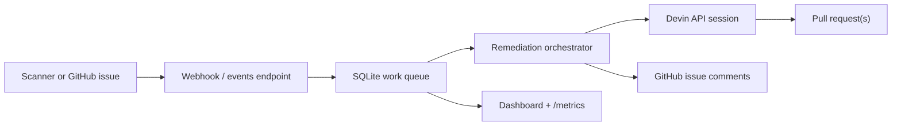

# Devin Superset Remediation Conveyor

This is a Dockerized, event-driven automation that turns engineering findings in an Apache Superset fork into managed Devin remediation sessions.

The pitch: instead of asking senior engineers to babysit dependency, security, and code-quality cleanup, this service treats each labeled GitHub issue or scanner finding as a work order. It launches Devin with repo context, tracks the session, links pull requests, posts status back to the issue, and exposes a dashboard/metrics endpoint so leaders can see whether the automation is actually moving work.

## Use Case

Target repository: `apache/superset`, copied or forked into your GitHub account.

Workflow problem: high-volume maintenance work accumulates because each issue is too small to schedule but too nuanced for a simple bot. Superset is a good proof point because it has Python, TypeScript, test, security, and dependency surfaces. This automation routes scoped findings to Devin when they are safe, measurable, and reviewable.

Seeded Superset issues live in [issues/superset-remediation-plan.json](issues/superset-remediation-plan.json) and are published on the fork at [Ritwik-Gaur/superset](https://github.com/Ritwik-Gaur/superset/issues):

- [#1](https://github.com/Ritwik-Gaur/superset/issues/1) Replace `shell=True` in the release test helper.
- [#2](https://github.com/Ritwik-Gaur/superset/issues/2) Move report scheduling hot paths away from deprecated `datetime.utcnow()`.
- [#3](https://github.com/Ritwik-Gaur/superset/issues/3) Implement the TODO'd `q` filter in `ExtensionsRestApi.get_list`.

## Architecture



The important design choice is that Devin is the execution primitive, not a helper call. The orchestrator owns intake, dedupe, session lifecycle, polling, and analytics. Devin owns the code investigation, patching, test execution, and PR creation.

## Quick Demo Without Credentials

The app defaults to deterministic dry-run mode when `DEVIN_API_KEY` is absent. This proves the eventing, queueing, dashboards, and reporting without requiring evaluator credentials.

```bash
cp .env.example .env
# Leave DEVIN_API_KEY blank or set DEVIN_DRY_RUN=true for the local demo.
make run
```

In a second terminal:

```bash
make simulate
open http://localhost:8080
curl -s http://localhost:8080/metrics
```

## Live Devin Mode

1. Fork or copy `https://github.com/apache/superset` into your GitHub account.
2. Create the seeded issues:

```bash
export GITHUB_TOKEN=ghp_...
export TARGET_REPOSITORY=YOUR_ORG/superset
make publish-issues
```

3. Configure Devin:

```bash
export DEVIN_API_KEY=cog_...
export DEVIN_ORG_ID=org-...
export DEVIN_REPO=YOUR_ORG/superset
export TARGET_REPOSITORY=YOUR_ORG/superset
export DEVIN_DRY_RUN=false
```

4. Run the service:

```bash
docker compose up --build
```

5. Add the `devin-remediate` label to any issue in the Superset fork, or POST a scanner event:

```bash
python3 scripts/local_superset_scan.py ./superset-fork > .data/scan-results.json
curl -X POST http://localhost:8080/events/scan \
  -H 'Content-Type: application/json' \
  --data-binary @.data/scan-results.json
```

## Webhook Setup

Create a GitHub webhook on your Superset fork:

- Payload URL: `https://YOUR_HOST/webhooks/github`
- Content type: `application/json`
- Secret: value of `GITHUB_WEBHOOK_SECRET`
- Events: Issues

The automation starts only when an issue has the `devin-remediate` label. That makes it safe to run in a real engineering org because humans can gate scope by labeling.

## Observable Outputs

- Dashboard: `http://localhost:8080`
- JSON jobs API: `http://localhost:8080/api/jobs`
- Prometheus-style metrics: `http://localhost:8080/metrics`
- GitHub issue comments when `GITHUB_TOKEN` is configured
- Devin session URLs and PR URLs on each work item

Metrics answer the VP Eng question:

- How many tasks are queued, running, succeeded, failed, or blocked?
- What is the success rate?
- How many PRs did Devin create?
- Which sessions are waiting on user input or approval?

## Why Devin

Dependabot and static scanners can identify work, but they cannot reliably navigate a large mixed Python/TypeScript codebase, understand local conventions, run targeted tests, adjust the patch, and open a coherent PR. Devin can. This service turns that ability into an operational system: events in, autonomous code remediation out, with observable progress and human review points.

## Submission Assets

- Architecture and tradeoffs: [docs/ARCHITECTURE.md](docs/ARCHITECTURE.md)
- 5-minute Loom script: [docs/LOOM_SCRIPT.md](docs/LOOM_SCRIPT.md)
- Submission checklist: [docs/SUBMISSION_CHECKLIST.md](docs/SUBMISSION_CHECKLIST.md)
- Superset issue plan: [issues/superset-remediation-plan.json](issues/superset-remediation-plan.json)
